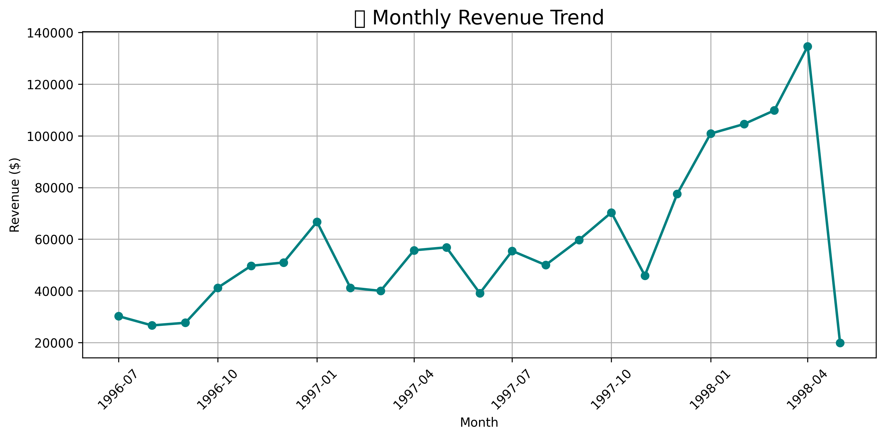

# ETL Portfolio Project – Customer Growth & Revenue Analysis 📊

This project builds a clean, modular ETL pipeline using Python, PostgreSQL, and Jupyter to analyze customer growth and revenue over time.

## 🔧 Tools Used
- Python (Pandas, psycopg2, Matplotlib)
- PostgreSQL (Northwind sample data)
- Jupyter Notebooks
- Visual Studio Code
- Git / GitHub

## 📦 Folder Structure
├── scripts/ # Reusable ETL scripts ├── notebooks/ # Jupyter notebooks & exported charts ├── data/ # Cleaned CSV output ├── logs/ # Logging from ETL runs ├── env/ # Virtual environment (ignored in git)

yaml
## 🚀 Pipelines Included

### 1. Monthly Customer Growth
- Extracted from PostgreSQL using psycopg2
- Transformed with Pandas
- Loaded into CSV
- Visualized customer acquisition trends over time

### 2. Monthly Revenue Summary
- Aggregated order data by month
- Exported & visualized as a clean trend chart

## 📈 Sample Output



---

Save and commit it:

```bash
git add README.md
git commit -m "Add README with project summary and chart"
git push
